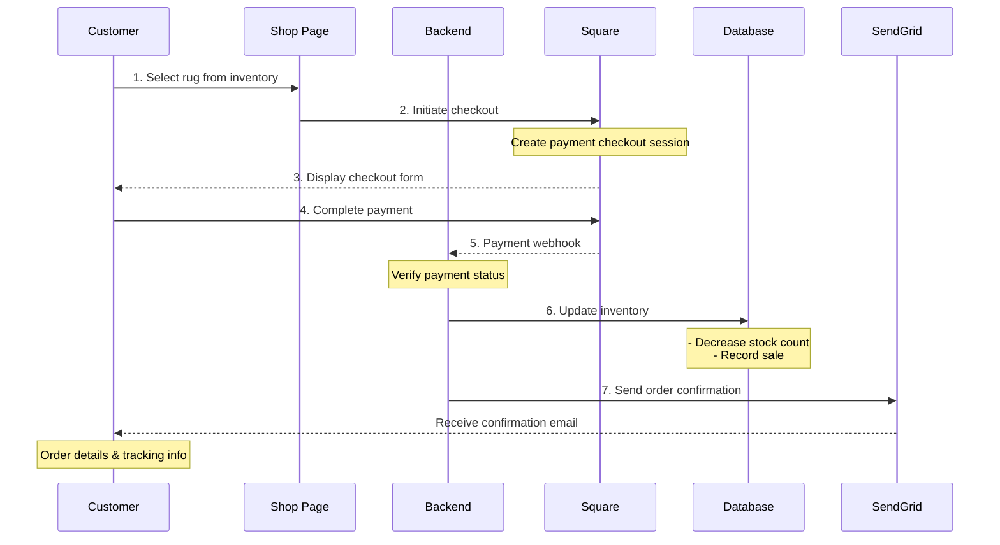

# CYO Rugs 🧶 | Create Your Own Rugs

[](https://github.com/gsnilloC/cyo-rugs/actions/workflows/ci-cd.yml)

https://www.cyorugs.com

### 💻 Created with


### Customer Purchase Flow


---

## 🚀 CI/CD & Deployment

This project uses **GitHub Actions** for continuous integration and deployment to **Heroku**.

### Pipeline Overview
- ✅ **Automated Testing**: Runs on every push and PR
- ✅ **Build Verification**: Ensures code compiles successfully
- ✅ **Manual Deployment**: Production deploys require approval
- ✅ **Health Checks**: Verifies app health after deployment

### Quick Setup
See [CICD_QUICKSTART.md](CICD_QUICKSTART.md) for setup instructions.

### Full Documentation
See [.github/CICD_SETUP.md](.github/CICD_SETUP.md) for complete CI/CD documentation.

---

## 🧪 Testing


### 📊 Test Coverage Summary

```
┌─────────────────────────────────────────────────────────┐
│  Component/API          │  Tests  │  Status             │
├─────────────────────────────────────────────────────────┤
│  🎨 Frontend Tests                                      │
│  ├─ App Component        │   25    │  ✅ Complete       │
│  ├─ Cart Component       │   27    │  ✅ Complete       │
│  └─ Product Component    │   48    │  ✅ Complete       │
│                                                          │
│  🔧 Backend API Tests                                   │
│  ├─ Items API            │   41    │  ✅ Complete       │
│  └─ Orders API           │   36    │  ✅ Complete       │
│                                                          │
│  📊 TOTAL                │  177    │  ✅ All Passing    │
└─────────────────────────────────────────────────────────┘
```

### 🎯 What's Tested

**Frontend Components:**
- ✅ App routing, theme, audio controls (25 tests)
- ✅ Shopping cart, discounts, checkout (27 tests)
- ✅ Product display, variations, add to cart (48 tests)

**Backend APIs:**
- ✅ Product catalog endpoints (41 tests)
- ✅ Custom orders CRUD operations (36 tests)

### 🚀 Quick Test Commands

```bash
# Run all 177 tests
npm test -- --watchAll=false

# Run frontend tests only
npm test -- App Cart Product

# Run backend tests only
npm test -- backend/

# Run with coverage report
npm test -- --coverage --watchAll=false

# Test specific component
npm test -- Cart.test.js
```

### 📁 Test Files

- [`src/spec/App.test.js`](src/spec/App.test.js) - Main app component tests
- [`src/spec/Cart.test.js`](src/spec/Cart.test.js) - Shopping cart tests
- [`src/spec/Product.test.js`](src/spec/Product.test.js) - Product page tests
- [`src/spec/backend/items.test.js`](src/spec/backend/items.test.js) - Items API tests
- [`src/spec/backend/orders.test.js`](src/spec/backend/orders.test.js) - Orders API tests

### 📈 Testing Tools

- **Jest** - Test runner and assertions
- **React Testing Library** - Component testing
- **Supertest** - API endpoint testing
- **GitHub Actions** - Automated CI/CD testing

---

## 📦 Development

### Setup
```bash
# Install dependencies
npm install

# Start development server (frontend + backend)
npm run dev

# Start frontend only
npm start

# Start backend only
npm run server
```

### Environment Variables
Create a `.env` file in the root directory:
```env
PORT=3000
DATABASE_URL=your_postgres_url
AWS_ACCESS_KEY_ID=your_aws_key
AWS_SECRET_ACCESS_KEY=your_aws_secret
SENDGRID_API_KEY=your_sendgrid_key
SQUARE_ACCESS_TOKEN=your_square_token
SQUARE_LOCATION_ID=your_square_location
RECAPTCHA_SECRET_KEY=your_recaptcha_secret
