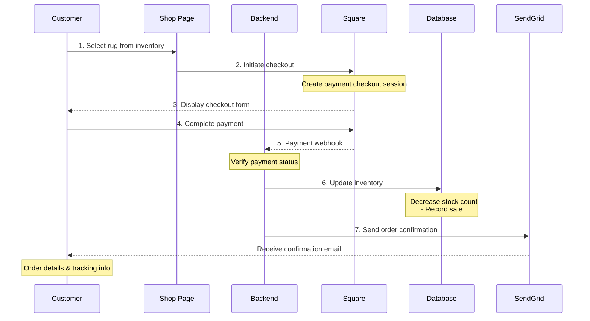

# CYO Rugs 🧶 | Create Your Own Rugs

[](https://github.com/gsnilloC/cyo-rugs/actions/workflows/ci-cd.yml)

https://www.cyorugs.com

### 💻 Created with


### Customer Purchase Flow


---

## 🚀 CI/CD & Deployment

This project uses **GitHub Actions** for continuous integration and deployment to **Heroku**.

### Pipeline Overview
- ✅ **Automated Testing**: Runs on every push and PR
- ✅ **Build Verification**: Ensures code compiles successfully
- ✅ **Manual Deployment**: Production deploys require approval
- ✅ **Health Checks**: Verifies app health after deployment

### Quick Setup
See [CICD_QUICKSTART.md](CICD_QUICKSTART.md) for setup instructions.

### Full Documentation
See [.github/CICD_SETUP.md](.github/CICD_SETUP.md) for complete CI/CD documentation.

---

## 🧪 Testing

### Available Test Commands
```bash
# Run all tests
npm test

# Run tests without watch mode
npm test -- --watchAll=false

# Run with coverage
npm test -- --coverage

# Future commands (as tests are added):
# npm run test:unit       # Frontend unit tests
# npm run test:backend    # Backend API tests
# npm run test:e2e        # End-to-end tests
# npm run test:all        # Run all test suites
```

### Testing Strategy
- **Unit Tests**: React component testing with Jest & React Testing Library
- **Integration Tests**: Backend API endpoint testing with Supertest
- **E2E Tests**: Full user flow testing with Playwright
- **Health Checks**: Production deployment verification

---

## 📦 Development

### Setup
```bash
# Install dependencies
npm install

# Start development server (frontend + backend)
npm run dev

# Start frontend only
npm start

# Start backend only
npm run server
```

### Environment Variables
Create a `.env` file in the root directory:
```env
PORT=3000
DATABASE_URL=your_postgres_url
AWS_ACCESS_KEY_ID=your_aws_key
AWS_SECRET_ACCESS_KEY=your_aws_secret
SENDGRID_API_KEY=your_sendgrid_key
SQUARE_ACCESS_TOKEN=your_square_token
SQUARE_LOCATION_ID=your_square_location
RECAPTCHA_SECRET_KEY=your_recaptcha_secret
